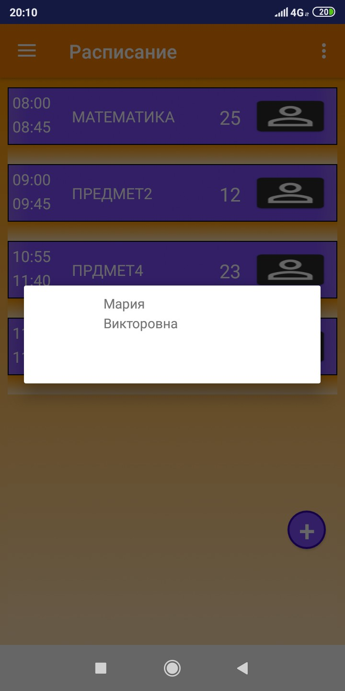

# AndroidApp
schedule for school

⦁	Приложение школьного расписания изначально рассчитывается на школьников(в перспективе для их родителей и учителей). Создана базовая часть приложения с планированием учебных занятий на день.

⦁	Хранение данных происходит в SQLite реализовано создание новых элементов, запрос всего списка, удаление и обновление данных списка.

⦁	В MainActivity распологается список составляемый пользователем вручную. Реализован он через SwipeMenuListView так что может уходить за границы экрана и каждый элемент списка может быть интерактивен. С помощью кнопки «+» пользователь переходит на экран добавления занятий.

⦁	В экране добавления занятий AddLessonActivity происходит заполнение формы элемента списка, также реализована маска для времени для более удобного заполнения пользователем. По нажатию кнопки «добавить» элемент добавляется в список, а пользователь переходит в MainActivity. Предусмотрена кнопка возврата в MainActivity (<-).

⦁	При Свайпе влево элемента списка происходит удаление этого элемента как с экрана пользователя, так и с БД.

⦁	При Свайпе вправо элемента списка происходит переход в UpdateLessonActivity данные по id подгружаются в форму и пользователь изменяет их при необходимости. По нажатию кнопки «обновить» элемент добавляется в список, а пользователь переходит в MainActivity. Предусмотрена кнопка возврата в MainActivity (<-).

⦁	При переходе на экран обновленя занятий UpdateLessonActivity происходит подгрузка заполненной формы элемента списка с помощью SQLite. По нажатию кнопки «обновить» происходит динамическое обновление списка, а пользователь переходит в MainActivity. Предусмотрена кнопка возврата в MainActivity (<-).

⦁	При нажатии в MainActivity на иконку учителя вызывается DialogMenu с дополнительной информацией о преподавателе.
